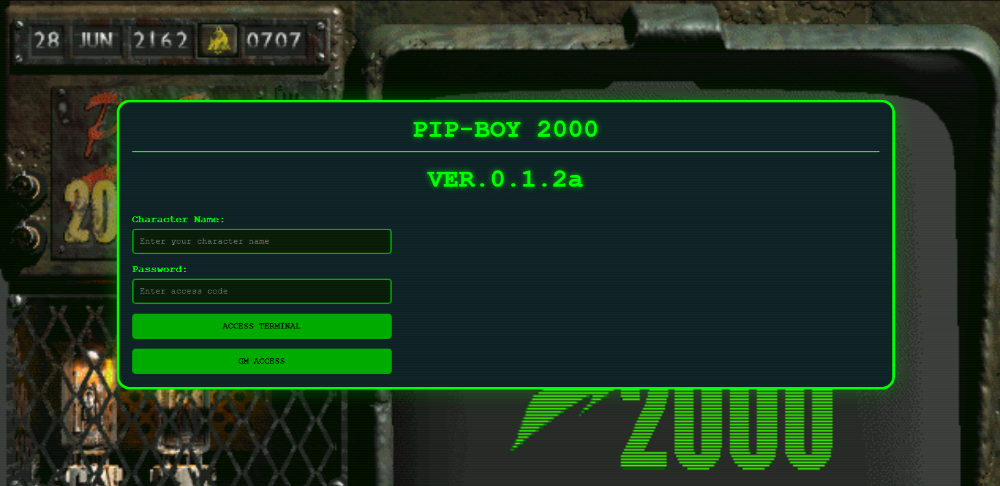
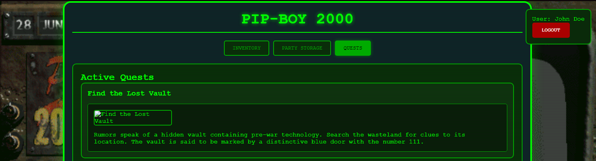
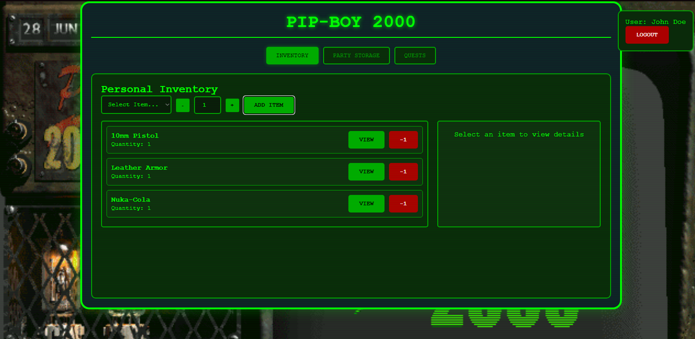
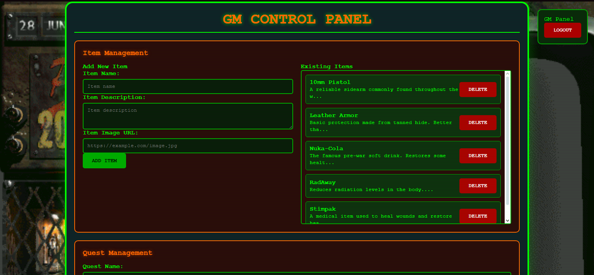

# 📟 PIPBOY 3000 | Chris's Fallout 2d20 GM Tools

A fully interactive, web-based **Pip-Boy 2000** interface for the [Fallout 2d20 TTRPG](https://www.modiphius.net/pages/fallout-the-roleplaying-game).  
Built with **Node.js**, this GM toolkit delivers real-time gameplay immersion directly to your players' screens.

> Bring the iconic Fallout Pip-Boy to your tabletop campaigns.

---

## 🎮 Login Screen

<!-- Replace the link below with an actual screenshot or GIF -->


---

## 🚀 Features

- **📜 Real-Time Quest Log**  
  Add and update quests on the fly — all players see updates immediately.

- **📦 Inventory & Item Management**  
  Add custom items with images, descriptions, and stats. Players can add them to their personal inventories.

- **🤝 Shared Party Storage**  
  Players can move items from personal inventory to shared party storage that’s accessible to all.

- **🧰 Built for Immersion**  
  Seamlessly integrates into Fallout-themed campaigns. A tactile digital extension of your tabletop experience.

- **🔧 Includes SQLite Database**
  Integrated SQLite Database, means no DB Access/Machine required, just without another step for simple setup. You can also use tools to edit the DB if needed.

---

## 🛠️ Installation

### 1. Clone the repository
```bash
git clone https://github.com/azebra1/pipboy.git
cd pipboy
```

### 2. Install dependencies
```bash
npm install
```

### 3. Run the app
```bash
npm start
```

### 4. Access in browser  
Navigate to `http://localhost:3000` or your deployed server's URL.

---

## 🖼️ Screenshots

<!-- Replace these placeholders with real screenshots -->
  
*Quest log, that's updated in real time*

  
*Custom items with images and descriptions*


*Custom GM Interface that allows for adding quests and new items*

---

## 💡 Use Case

This tool is designed for **GMs running Fallout 2d20** campaigns who want to:

- Increase immersion and interactivity  
- Digitally manage items and quests  
- Provide a consistent visual interface players can rely on  

---

## 📚 Tech Stack

- **Node.js**  
- **Socket.io** (for real-time updates)  
- **Express.js**  
- **HTML/CSS/JavaScript frontend**

---

## 📢 Contributing

Want to help improve this tool?  
Feel free to fork the repo and submit a pull request!

---

## 🧾 License

This project is licensed under the [MIT License](LICENSE).

---

## ☢️ Stay Immersed, Stay Safe.

> *“War. War never changes.”*  
> — Fallout Series
